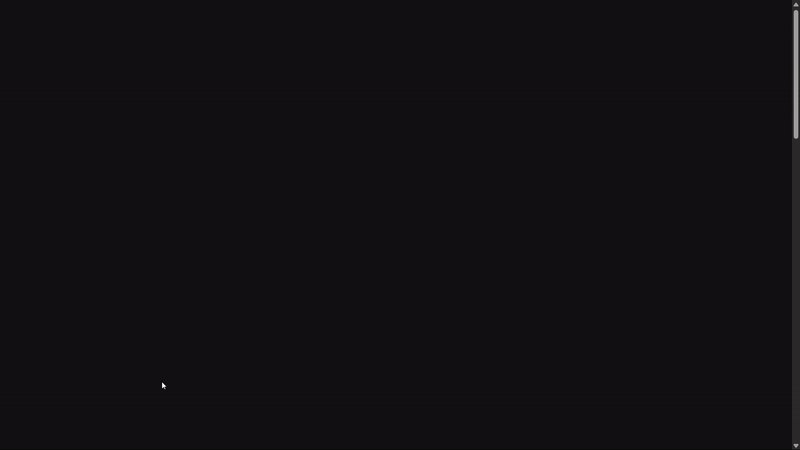

# 🎨 Scroll-Pinned Letter-by-Letter Text Color Animation

A stunning scroll-triggered text animation built with **GSAP** and **ScrollTrigger**, where each character **changes color individually** as the user scrolls. The text is **pinned in place**, and a smooth wave of color flows through it — creating a **mesmerizing, modern web effect**.

## ✨ Preview



> 🌀 As you scroll, the text remains fixed while each letter lights up in a cascading wave.

## 🚀 Features

- 🧲 **Scroll-pinned text**
- 🎨 **Character-by-character color transitions**
- 🌈 Built with **GSAP 3 + ScrollTrigger**
- ⚡ Lightweight and responsive
- 🔁 Smooth scroll-scrubbing effect
- 🧩 Easy to customize colors, text, and timing

## 📦 Installation

```bash
git clone https://github.com/Krish-Na203/Sankey_Website.git
cd scroll-text-animation
open index.html
```

## 🧠 Author

Made with 💙 by Krishna
